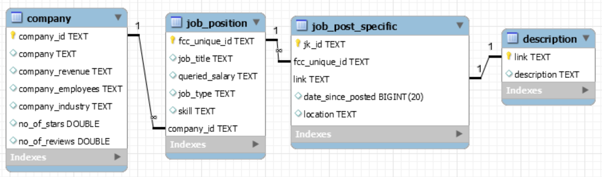

The following project involves migrating the MySQL database used for our Data Science Skills project to MongoDB. The original database consisted of 4 tables: company, job_position, job_post_specific, and description. The column list and relationships are detailed in the diagram below.



As conveyed by the diagram, the database consists of companies which in turn publish job positions. Some of those positions are listed in different geographic areas and may have slight variations. Those sub listings are captured in the job_post_specific_table. Finally, the description table was used to separate the HTML link and the description text from each unique sub-listing.

For the migration to MongoDB, we will first import the company table as a separate collection. The default object ID will be replaced by the primary key used in the MySQL table in order to maintain the relationship with the job_position data through a document reference.

There is a 1:1 between each listing (job_post_specific table ) and its link and description (description table), so we'll merge both tables into the same document.

Although there may be several job listings (job_post_specific) derived from one position (job_position) the ratio isn't very high and the bulk of the data is contained in the description. For this reason, we will merge the job position data into the job listings even if that means repeating some of the data. As we did with the description table, we will replace the default object ID with the primary key of the job_post_specific table.

Below are sample documents from our final database.

```{r}
# Company Collection Sample

{
    "_id": "c_10",
    "company": "3M",
    "company_revenue": "More than $10B (USD)",
    "company_employees": "10,000+",
    "company_industry": "Industrial Manufacturing",
    "no_of_stars": 4.099999905,
    "no_of_reviews": 2837
}


# Listing Collection Sample

{
    "_id": "fec647775a21ecc6",
    "job_title": "Data Scientist I",
    "company": "Federal Reserve Bank of Dallas",
    "company_id": "c_782",
    "location": "TX",
    "description": "[<ul><li>Assist in consultations with business partn...",
    "queried_salary": "<80000",
    "skill": [
        "Statistical Software",
        "Time Management",
        "R",
        "Microsoft Office",
        "Excel",
        "Tableau",
        "Data Science"
    ],
    "job_type": "data_scientist",
    "date_since_posted": 30,
    "link": "https://www.indeed.com/rc/clk?jk=fec647775a21ecc6&fccid=2c6850e24c8a2811&vjs=3"
}
```

In this particular case, I don't think either storage model is ideal for this dataset and choosing a platform would depend on how the data will be used. In the data set, we have two distinct entities (companies and listings) which are composed of very different data but are still closely related. Additionally, some large companies publish the same position is different locations or with slight variations. The relational model seems to be better suited at keeping these entities separate while preserving their relationships. 

On the other hand, most of the data is contained within the job listing which can be easily stored on MongoDB's document model. MongoDB's schemaless design is more flexible and would make it easier to expand and adapt the data set for future applications. MongoDB also has built-in Geolocation capabilities which could be useful in this application.

If I were to start a similar project from scratch I would still opt for MongoDB, since the relational model isn't an absolute necessity for this data and the schemaless design would give me more flexibility.

**The code for the migration is detailed below.**

First, we load the required libraries.
```{r libraries, message=FALSE, warning=FALSE}
library(mongolite)
library(tidyverse)
library(RMySQL)
library(jsonlite)
```

We establish a connnection to the MySQL Server.
```{r MySQL Connection}
mydb <- 
  DBI::dbConnect(
    RMySQL::MySQL(), 
    dbname = 'project3', 
    host = "35.232.240.247", 
    user = "root", 
    password = rstudioapi::askForPassword("Database password"))
```

We list the tables to verify that the connection is working.
```{r MySQL Table List}
dbListTables(mydb)
```

We load the `company` table onto a data frame and we rename the primary key as `_id`.
```{r MySQL Companies}
company <- dbGetQuery(mydb,"SELECT * FROM company") %>% 
  rename("_id" = "company_id")
```

We join the `job_post_specific`, `job_position` and `description` tables, keeping the primary key from the `job_post_specific` table. We will include the company name along with the listings for easy referencing.
```{r MySQL Listings}
listing <- 
  dbGetQuery(mydb,
    "SELECT 
      jk_id,
      job_title,
      company,
      company_id,
      location,
      description,
      queried_salary,
      skill,
      job_type,
      date_since_posted,
      link
    FROM
      company
    NATURAL JOIN
      job_post_specific
    NATURAL JOIN
      job_position
    NATURAL JOIN
      description;")
```

The skills list is stored as a string in the MySQL database. The transformation below will convert the string into a list which in turn will be converted into an array once the data is imported into MongoDB. We will also rename the primary key as `_id`.
```{r Skills transformation}
listing <- listing %>% 
  mutate(skill = str_replace_all(skill,"', '", "\\|")) %>% 
  mutate(skill = str_replace_all(skill,"(\\[')|('\\])", "")) %>% 
  mutate(skill = as.list(strsplit(skill, "\\|"))) %>% 
  rename('_id' = `jk_id`)
```

Now that we have our data ready we can create two connections to MongoDB, one for each collection.
```{r mongodb-connections}
mgcompany <- mongo(collection = "company",db = "DS-Skills", url = "mongodb://localhost",
  verbose = FALSE, options = ssl_options())
mglistings <- mongo(collection = "listings",db = "DS-Skills", url = "mongodb://localhost",
  verbose = FALSE, options = ssl_options())
```

Once the connections are established we can upload the data to the new database.
```{r Upload to MongoDB}
mgcompany$insert(company)
mglistings$insert(listing)
```
